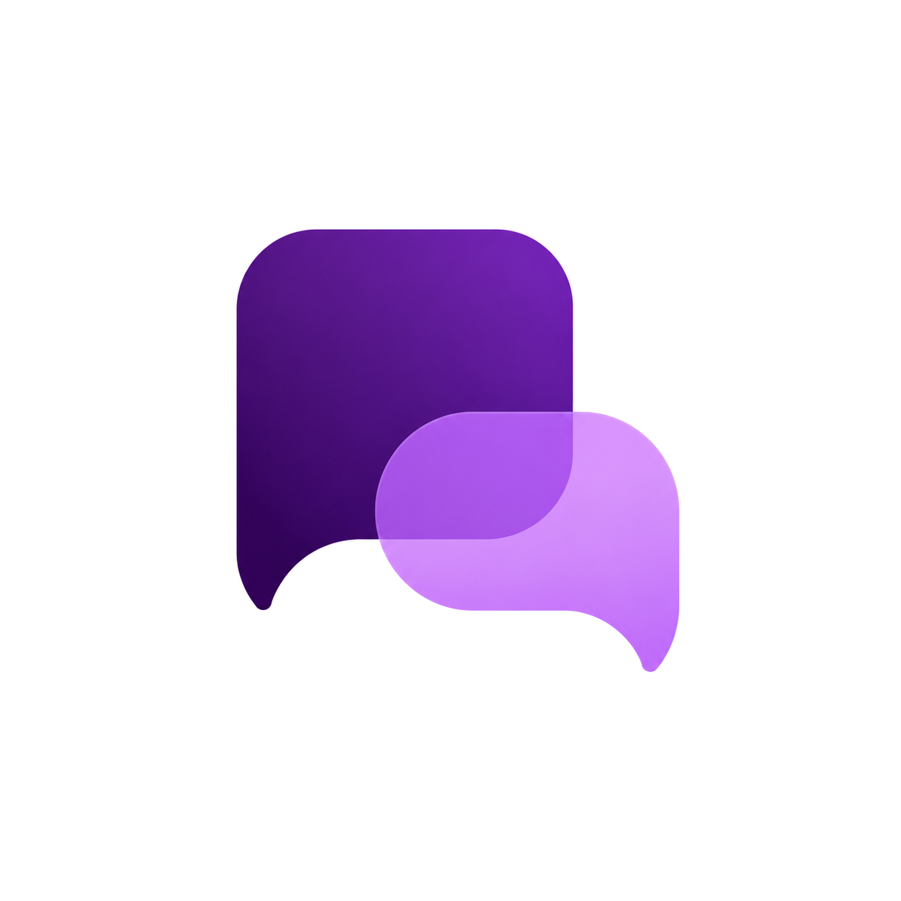

<p align="center">
  
</p>

<h1 align="center">Offthread</h1>

<p align="center">
  Margin notes for Claude, ChatGPT, and Gemini
</p>

<p align="center">
  <a href="https://chromewebstore.google.com/detail/ieekphhmaohoodalgaboiolcmmpoagmi">
    
  </a>
</p>

Highlight any span in a reply, a bubble opens in a right-hand gutter, and you ask
a short question about just that excerpt. The answer streams into the bubble.
**The main conversation is never touched.**

Uses the session you already have on that host — no second login, no API key.

Formerly **Tangent**. Same Chrome Web Store item.

> Chrome extension, Manifest V3. [Install from the Chrome Web Store](https://chromewebstore.google.com/detail/ieekphhmaohoodalgaboiolcmmpoagmi) · [Site](https://r0han99.github.io/tangent/) · [`offthread-prd-v2.md`](./offthread-prd-v2.md)

## How it works

- A content script runs on Claude, ChatGPT, and Gemini. `fetch` uses that
  page’s session. Host-specific network lives in [`src/hosts/`](./src/hosts/);
  [`src/api/client.ts`](./src/api/client.ts) is the shared facade.
- Highlights use the **CSS Custom Highlight API**, not `<span>` wrapping.
- Each bubble is its own side thread on the current host. Context is: system
  instruction, excerpt, your question, and that bubble’s prior turns.

## Develop

```bash
npm install
npm run dev      # Vite + HMR; load dist/ as an unpacked extension
npm run build    # typecheck + production build into dist/
npm run typecheck
npm run pack     # build + zip dist/ for Chrome Web Store upload
```

### Load in Chrome

1. `npm run build` (or `npm run dev`).
2. Open `chrome://extensions`, enable **Developer mode**.
3. **Load unpacked** → select the `dist/` folder.
4. Open Claude, ChatGPT, or Gemini, select text, click **Ask Offthread**.

## Chrome Web Store

**Install:** [Offthread on the Chrome Web Store](https://chromewebstore.google.com/detail/ieekphhmaohoodalgaboiolcmmpoagmi)

Public site (GitHub Pages from `main` / root):

- Landing: https://r0han99.github.io/tangent/
- Roadmap: https://r0han99.github.io/tangent/roadmap.html
- Privacy: https://r0han99.github.io/tangent/privacy.html

Listing / pack notes for updates live in [`STORE.md`](./STORE.md). For a new store build:

```bash
npm run pack   # writes offthread-<version>.zip at the repo root
```

## Project layout

```
src/
  content/   entry, selection capture, highlight painting, host layout
  hosts/     claude / chatgpt / gemini adapters (DOM + session API)
  gutter/    Gutter (stacking), Bubble, Composer, stack.ts
  api/       client.ts facade, sse.ts, types.ts
  state/     zustand store: bubbles, active bubble, usage
  options/   options page (default model, archive-on-close)
  config.ts  every layout/behavior constant and the system instruction
```

## Milestones (from the PRD)

- **M1** gutter + selection + highlighting + stacking (no network) — done
- **M2** isolated API client + SSE streaming — done; exercise it from the
  devtools console via `window.__tangent` on any claude.ai tab
- **M3** integration: real questions/answers, per-bubble threads, follow-ups — done
- **M4** auto-titling, archive-on-close, per-bubble model selector, usage
  footer, narrow-viewport popover fallback, options page — done

### Testing the API layer standalone (M2)

On a `claude.ai` tab with the extension loaded, open devtools:

```js
const t = await window.__tangent.createThread("Tangent: scratch");
const res = await window.__tangent.sendMessage(t, "Say hi in three words.");
await window.__tangent.streamReply(res, (d) => console.log(d));
```

## Caveats

- **Internal endpoints.** claude.ai's endpoints are undocumented app plumbing and
  can change without notice. When something breaks, re-observe the network tab and
  fix `src/api/client.ts` — nothing else touches the network. The request shapes in
  that file are best-effort and should be verified against live traffic.
- **Soft persistence.** Bubbles are saved per conversation in `chrome.storage.local`
  and re-anchored when you reload or return to the thread. If the excerpt is gone
  from the DOM, that bubble is skipped silently.
- **Chromium only.** Requires the CSS Custom Highlight API (Chrome 105+).
- **Terms of service.** This drives your own session from your own browser. Review
  Anthropic's usage policies before relying on it (PRD §9).
